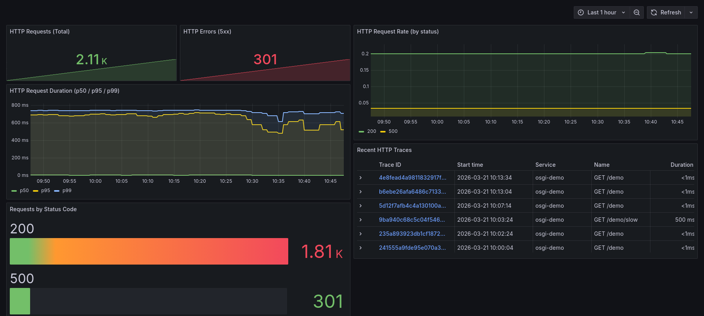
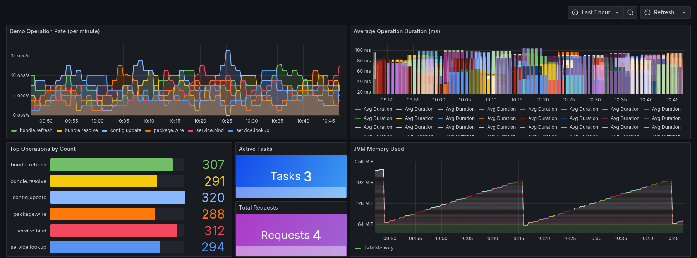
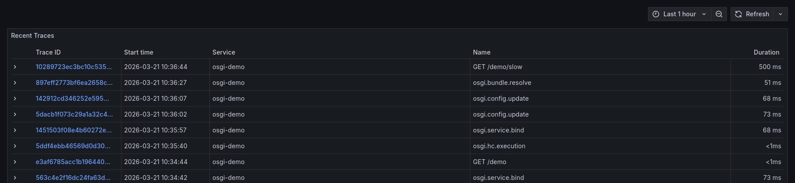

# OpenTelemetry OSGi Integration

Integration of [OpenTelemetry](https://opentelemetry.io/) with the [OSGi](https://www.osgi.org/) service platform.

## What is OpenTelemetry?

[OpenTelemetry](https://opentelemetry.io/) (OTel) is an open-source, vendor-neutral observability framework for generating, collecting, and exporting telemetry data.
It provides a unified set of APIs, SDKs, and tools to instrument applications and infrastructure, enabling deep visibility into distributed systems.

OpenTelemetry defines three core **signals**:

- **Traces** — End-to-end journey of a request through a distributed system, represented as spans with timing, attributes, and parent-child relationships
- **Metrics** — Quantitative measurements (counters, histograms, gauges) about application behavior over time
- **Logs** — Structured log records with automatic trace correlation via the [Log Bridge API](https://opentelemetry.io/docs/specs/otel/logs/bridge-api/)

## Project Structure

```
opentelemetry-osgi/
├── core/                    — Core runtime providing OpenTelemetry SDK as an OSGi service
├── integrations/            — Bridges for OSGi subsystems (framework, SCR, log)
├── weaving/                 — OSGi WeavingHook based bytecode instrumentation (HTTP servlets)
├── demo/                    — Demonstration bundles showcasing the integration
├── features/                — Apache Karaf feature descriptors for deployment
├── incubator/               — Experimental modules (agent extension)
├── docker/                  — Docker demo with full Grafana observability stack
└── docker-compose.yml
```

| Folder | Description | Details |
|---|---|---|
| [`core/`](core/README.md) | OpenTelemetry SDK runtime as an OSGi service | [Read more →](core/README.md) |
| [`integrations/`](integrations/README.md) | Framework, SCR, Log Service, Health Check, and Config Admin bridges to OpenTelemetry | [Read more →](integrations/README.md) |
| [`weaving/`](weaving/README.md) | OSGi WeavingHook based HTTP servlet instrumentation with ASM | [Read more →](weaving/README.md) |
| [`demo/`](demo/README.md) | Demo bundle generating sample traces, metrics, and logs | [Read more →](demo/README.md) |
| [`features/`](features/README.md) | Karaf features for runtime, integrations, and demo deployment | [Read more →](features/README.md) |
| [`incubator/`](incubator/README.md) | Java Agent extension for bytecode-level OSGi instrumentation | [Read more →](incubator/README.md) |

## Prerequisites

- Java 21 or later
- Maven 3.9+

## Building

```bash
mvn clean install
```

## Quick Start — Pre-built Distribution

The fastest way to get started is with the pre-built Karaf distribution:

```bash
mvn clean install -DskipTests
cd features/opentelemetry-osgi-karaf-distribution/target/assembly
bin/karaf
```

All features are pre-installed and start automatically.
No network access is required at runtime.

For manual deployment into an existing Karaf, see [features/README.md](features/README.md).

## Docker Demo

The easiest way to see the integration in action is the Docker Compose demo.
It spins up the full Grafana observability stack with a single command:

```
OSGi App (Karaf + our features)
    │ OTLP/HTTP
    ▼
OTel Collector (Gateway)
    │
    ├──→ Tempo     (Traces)
    ├──→ Prometheus (Metrics)
    └──→ Loki      (Logs)
          │
          ▼
       Grafana (UI + Explore + Dashboards)
```

```bash
# Build and start everything
docker compose up --build -d

# Watch the OSGi application logs
docker compose logs -f osgi-app

# Open Grafana at http://localhost:3000

# Stop and clean up
docker compose down -v
```

### Pre-built Dashboard

Open [http://localhost:3000](http://localhost:3000) (no login required) and navigate to **Dashboards → OpenTelemetry OSGi → OSGi Observability Overview**.

The dashboard provides a comprehensive view of the running OSGi runtime:

#### 🧩 OSGi Framework

Bundle and service counts, state distribution, active bundle tracking.


#### ⚙️ Declarative Services (SCR)

Component state distribution, satisfied/unsatisfied references, active component counts.


#### 📋 OSGi Log Service

Log entries by level, error counts per bundle.


#### 🏥 Felix Health Checks

Health check status overview, execution rate, check duration.


#### 🔧 Config Admin

Configuration counts, factory configurations, event rate over time.


#### 🌐 HTTP Servlet (Weaving)

HTTP request rate by status code, duration percentiles (p50/p95/p99), error counts, recent HTTP traces.



#### 🚀 Demo Operations

Operation rate by type, average duration, top operations, active tasks.



#### 🔍 Recent Traces & 📝 Live Logs

Trace table with span names and streaming structured logs from Loki.



### Explore in Grafana

Use the **Explore** view (compass icon in the sidebar) to query each backend directly:

- **Traces** — select the *Tempo* datasource: trace names include `osgi.bundle.resolve`, `osgi.bundle.refresh`, `osgi.service.bind`, `osgi.service.lookup`, `osgi.scr.healthcheck`, `osgi.hc.execution`, `osgi.cm.updated`, `osgi.cm.deleted`
- **Metrics** — select the *Prometheus* datasource: `osgi_bundle_count`, `osgi_bundle_active`, `osgi_bundle_states`, `osgi_service_count`, `osgi_scr_component_count`, `osgi_scr_component_states`, `osgi_hc_count`, `osgi_hc_status`, `osgi_cm_configuration_count`, `osgi_cm_factory_count`, `osgi_log_entries_total`, `osgi_demo_operations_total`, `http_server_requests_total`, `http_server_duration_milliseconds`
- **Logs** — select the *Loki* datasource: query `{service_name="osgi-demo"}` for bundle/service inventory, SCR component state, and forwarded OSGi log entries

## Technology Stack

| Technology | Version | Purpose |
|---|---|---|
| Java | 21 | Language runtime |
| OpenTelemetry Java | 1.49.0 | Observability framework |
| OSGi Framework | R8 (1.10.0) | Module system |
| OSGi Declarative Services | 1.5.1 | Component model |
| bnd-maven-plugin | 7.1.0 | OSGi metadata generation |
| Apache Karaf | 4.4.7 | OSGi container |
| Apache Felix Health Check | 2.0.4 / 2.0.8 / 3.0.8 | Health check API, core, and general checks |
| Apache Aries SPI Fly | 1.3.7 | Cross-bundle ServiceLoader support |
| ASM | 9.7.1 | Bytecode manipulation for weaving |
| Grafana | 11.5.2 | Observability UI |
| Grafana Image Renderer | 3.12.1 | Dashboard screenshot rendering |
| Grafana Tempo | 2.7.2 | Distributed tracing backend |
| Prometheus | 3.2.1 | Metrics backend |
| Grafana Loki | 3.4.2 | Log aggregation backend |
| OTel Collector | 0.120.0 | Telemetry gateway |

## License

This project is licensed under the [Eclipse Public License v2.0](LICENSE).
