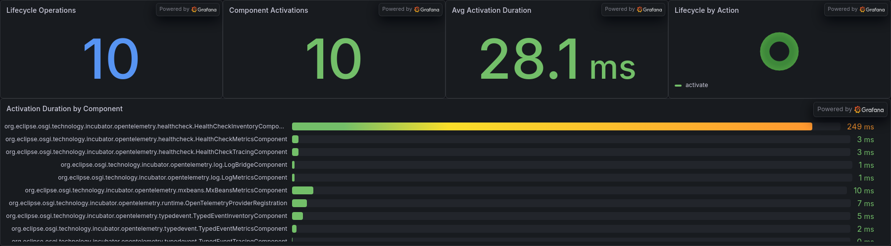
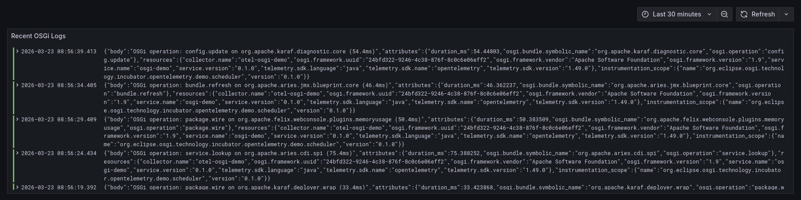
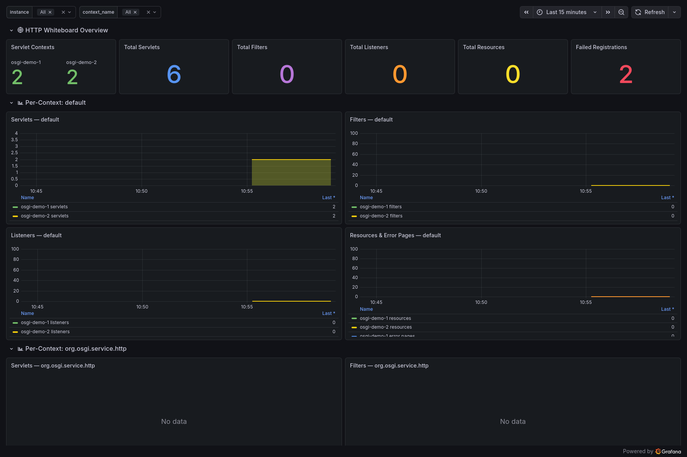
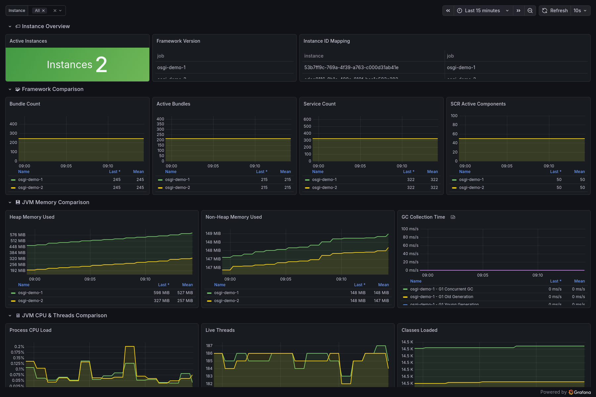
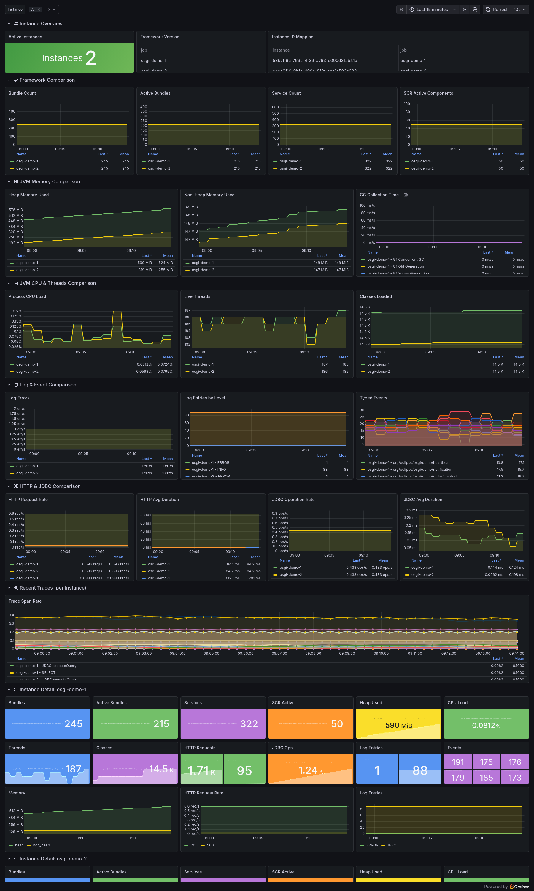

# OpenTelemetry OSGi Demo

Demonstration bundle that consumes the `OpenTelemetry` service via Declarative Services and generates sample telemetry to showcase the integration.

## Demo Components

| Component | Description |
|---|---|
| `TracingDemoComponent` | Creates sample spans with attributes, events, and nested child spans |
| `MetricsDemoComponent` | Produces counters, histograms, and up-down counters with varying values |
| `LogBridgeDemoComponent` | Emits structured log records through the OpenTelemetry Logs API |
| `ContextPropagationDemoComponent` | Demonstrates W3C TraceContext propagation across async boundaries |
| `DemoSchedulerComponent` | Periodically triggers all demo components on a configurable interval |
| `HttpDemoServlet` | Servlet registered at `/demo/*` with status, slow, and error endpoints |
| `HttpTrafficGeneratorComponent` | Periodically hits servlet endpoints every 10 seconds |
| `JdbcDemoComponent` | Creates an H2 in-memory database and runs CRUD queries every 10 seconds |
| `JaxRsDemoResource` | JAX-RS resource at `/api/rest/*` with status, items, and detail endpoints |
| `JaxRsDispatcherServlet` | Lightweight annotation-based JAX-RS dispatcher |
| `JaxRsTrafficGeneratorComponent` | Generates traffic to JAX-RS endpoints every 12 seconds |

The demo module depends only on `opentelemetry-api` (not the SDK), following the recommended practice of separating instrumentation from SDK configuration.

## Usage

### In Karaf

```bash
feature:repo-add mvn:org.eclipse.osgi-technology.incubator/opentelemetry-osgi-demo-karaf-feature/0.1.0-SNAPSHOT/xml/features
feature:install opentelemetry-osgi-demo
```

### Docker Demo

The easiest way to see the integration in action is the Docker Compose demo.
It spins up the full Grafana observability stack with two OSGi container instances:

```
OSGi App 1 (Karaf)──┐
                     │ OTLP/HTTP
OSGi App 2 (Karaf)──┤
                     ▼
              OTel Collector (Gateway)
                     │
                     ├──→ Tempo     (Traces)
                     ├──→ Prometheus (Metrics)
                     └──→ Loki      (Logs)
                           │
                           ▼
                        Grafana (UI + Drilldown + Dashboards)
```

```bash
# Build and start everything (from the repository root)
docker compose up --build -d

# Watch the OSGi application logs
docker compose logs -f osgi-app osgi-app-2

# Open Grafana at http://localhost:3000

# Stop and clean up
docker compose down -v
```

### Endpoints

When running the Docker demo:
- [http://localhost:8181/demo](http://localhost:8181/demo) — HTTP servlet endpoints (instance 1)
- [http://localhost:8182/demo](http://localhost:8182/demo) — HTTP servlet endpoints (instance 2)
- [http://localhost:8181/api/rest/status](http://localhost:8181/api/rest/status) — JAX-RS resource endpoints (instance 1)
- [http://localhost:8182/api/rest/status](http://localhost:8182/api/rest/status) — JAX-RS resource endpoints (instance 2)

## Dashboards

Open [http://localhost:3000](http://localhost:3000) (no login required) and navigate to **Dashboards**.
The demo ships with six pre-built Grafana dashboards.
All dashboards include an **Instance** dropdown for filtering by specific OSGi container instances.

### Drilldown (Traces, Metrics, Logs)

The Docker demo ships with **Grafana Drilldown** apps pre-installed and enabled:

- **Drilldown → Traces** — Explore all traces from Tempo with filtering, breakdown by service/operation, service structure graph, and comparison views
- **Drilldown → Metrics** — Explore all Prometheus metrics with automatic RED metric aggregation
- **Drilldown → Logs** — Explore all Loki log streams with pattern detection and filtering

Tempo's **metrics generator** is configured to produce span metrics (RED — Rate, Errors, Duration) and service graphs from ingested traces.
These are written to Prometheus and power the Traces Drilldown's span rate and duration visualizations.

### OSGi Observability Overview

The main dashboard provides a comprehensive view of the running OSGi runtime.

#### 🧩 OSGi Framework

Bundle and service counts, state distribution, active bundle tracking.


#### ⚙️ Declarative Services (SCR)

Component state distribution, satisfied/unsatisfied references, active component counts.


#### 📋 OSGi Log Service

Log entries by level, error counts per bundle.


#### 🏥 Felix Health Checks

Health check status overview, execution rate, check duration.


#### 🔧 Config Admin

Configuration counts, factory configurations, event rate over time.


#### 📨 Typed Events

Events published per topic, event rate, handler counts (typed vs untyped), topic prefix distribution.


#### ⚙️ SCR Lifecycle (Weaving)

DS component activation/deactivation timing, per-component duration breakdown, lifecycle action distribution.



#### 🌐 HTTP Servlet (Weaving)

HTTP request rate by status code, duration percentiles (p50/p95/p99), error counts, recent HTTP traces.


#### 🗄️ JDBC (Weaving)

Database operation counts, operations per second, duration percentiles, SQL query traces.


#### 🔗 JAX-RS (Weaving)

JAX-RS resource request counts, request rate, duration percentiles, per-route breakdowns.


#### 🚀 Demo Operations

Operation rate by type, average duration, top operations, active tasks.


#### 🔍 Recent Traces & 📝 Live Logs

Trace table with span names and streaming structured logs from Loki.




### JVM MXBeans Overview

A separate dashboard provides deep JVM runtime visibility.
See the [MXBeans module README](../../integrations/opentelemetry-osgi-mxbeans/README.md) for the full set of metrics and all dashboard sections.


### JDBC Weaving Dashboard

Dedicated dashboard for JDBC instrumentation with database operation counts, per-operation duration percentiles, and SQL query traces.


### JAX-RS Weaving Dashboard

Dedicated dashboard for JAX-RS resource instrumentation with per-route request counts, duration percentiles, and resource method breakdowns.


### HTTP Whiteboard Dashboard

Dedicated dashboard for HTTP Whiteboard runtime introspection with servlet contexts, servlet/filter/listener/resource counts, and repeating per-context panels.
See the [HTTP Whiteboard module README](../../integrations/opentelemetry-osgi-http-whiteboard/README.md) for the full set of metrics.



### Multi-Instance Comparison

The **OSGi Multi-Instance Comparison** dashboard enables side-by-side comparison of multiple OSGi container instances.
The Docker demo runs two Karaf instances (`osgi-demo-1` and `osgi-demo-2`) reporting to the same collector.
Each instance is uniquely identified by the OSGi framework UUID, automatically set as `service.instance.id`.

Use the **Instance** dropdown to filter by specific instances or compare all at once.
The dashboard includes **repeating panels** that automatically create per-instance detail rows.



The dashboard compares framework metrics, JVM memory/CPU/threads, log entries, HTTP and JDBC operations, and trace span rates across instances.



### Explore in Grafana

Use the **Explore** view (compass icon in the sidebar) to query each backend directly:

- **Traces** — select the *Tempo* datasource: trace names include `osgi.bundle.resolve`, `osgi.service.bind`, `osgi.scr.healthcheck`, `osgi.hc.execution`, `osgi.cm.updated`, `osgi.typedevent.deliver`, `scr.activate`, `GET /demo`, `JDBC executeQuery`, `GET /api/rest/status`
- **Metrics** — select the *Prometheus* datasource: `osgi_bundle_count`, `osgi_service_count`, `osgi_scr_component_states`, `osgi_hc_status`, `osgi_cm_configuration_count`, `osgi_log_entries_total`, `osgi_typedevent_events_total`, `http_server_requests_total`, `db_client_operations_total`, `jaxrs_server_requests_total`, `scr_lifecycle_operations_total`, `jvm_memory_used_bytes`, `jvm_cpu_process_load`
- **Logs** — select the *Loki* datasource: query `{service_name=~"osgi-demo-.*"}` for bundle/service inventory, SCR component state, and forwarded OSGi log entries
