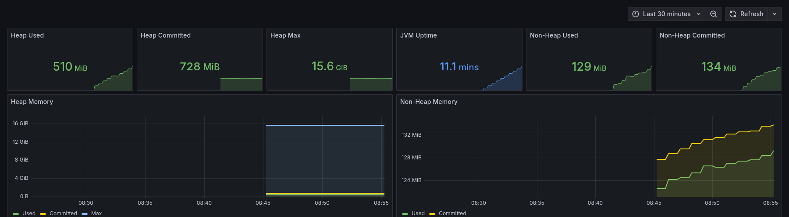
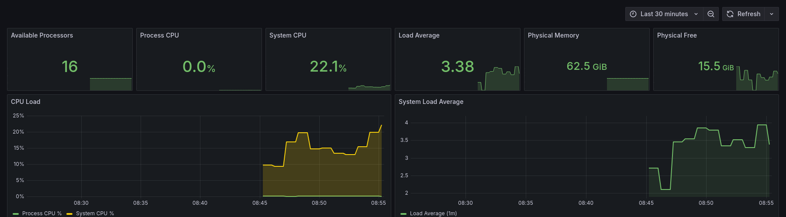
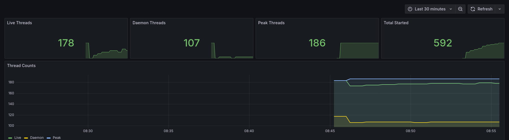
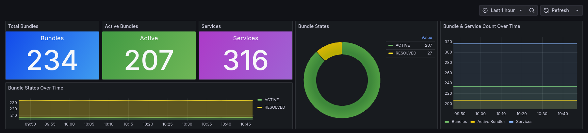
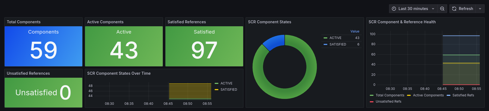
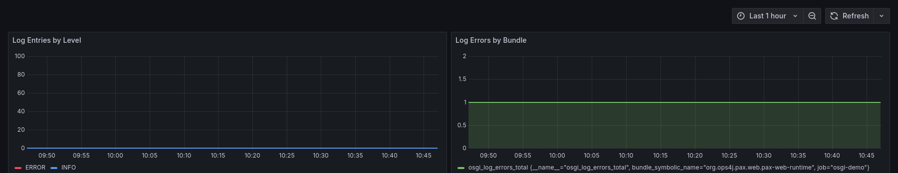
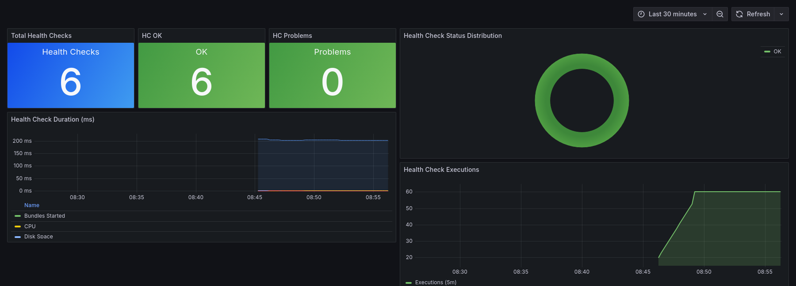
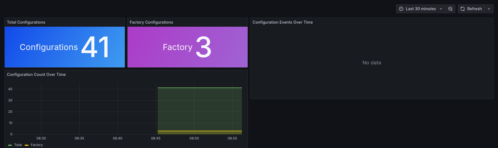
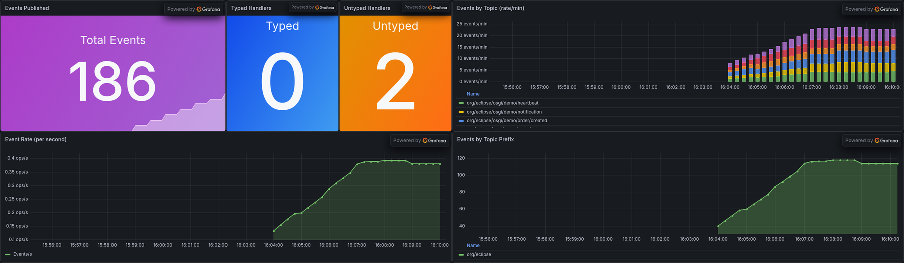

# OpenTelemetry OSGi Integrations

This folder contains integration bundles that bridge various OSGi subsystems into OpenTelemetry telemetry signals.
Each module consumes the `OpenTelemetry` service published by the [core runtime](../core/README.md) and produces domain-specific traces, metrics, and logs.

## Modules

### opentelemetry-osgi-framework

Bridges the OSGi core framework state into OpenTelemetry:

- **Framework Metrics** — Gauges for total bundle and service counts
- **Framework Events** — Traces for bundle install/start/stop/uninstall and service register/unregister events
- **Bundle Inventory** — Structured log records with a live snapshot of all bundles plus change tracking via `SynchronousBundleListener`
- **Service Inventory** — Structured log records with a live snapshot of all services plus change tracking via `ServiceListener`

### opentelemetry-osgi-scr

Exposes OSGi Declarative Services (SCR) component state as OpenTelemetry telemetry:

- **SCR Metrics** — Gauges for component states (active, satisfied, unsatisfied, failed)
- **SCR Inventory** — Structured log records enumerating all DS component descriptions and configurations
- **SCR Health Check** — Periodic health trace that flags non-active components with their unsatisfied references

Uses the [SCR Introspection API](https://docs.osgi.org/specification/osgi.cmpn/8.0.0/service.component.html#service.component-introspection) (`ServiceComponentRuntime`).

### opentelemetry-osgi-log

Forwards OSGi Log Service entries to OpenTelemetry:

- **Log Bridge** — Registers as a `LogListener` on `LogReaderService` and forwards each `LogEntry` as an OpenTelemetry log record with full context (bundle info, severity, exception details, thread info)
- **Log Metrics** — Counters for log entries by level and error counters by bundle name

Uses the [OSGi Log Service](https://docs.osgi.org/specification/osgi.core/8.0.0/service.log.html) (`LogReaderService`).

### opentelemetry-osgi-felix-healthcheck

Bridges [Apache Felix Health Checks](https://felix.apache.org/documentation/subprojects/apache-felix-healthcheck.html) into OpenTelemetry:

- **Health Check Metrics** — Gauges for total health check count, status distribution (OK, WARN, CRITICAL, TEMPORARILY_UNAVAILABLE), and execution duration
- **Health Check Tracing** — Periodic execution of all registered health checks, producing a parent span `osgi.hc.execution` with child spans per individual check result
- **Health Check Inventory** — Structured log records listing all registered health checks with their names, tags, and status at activation time

Uses the Felix Health Check API (`HealthCheckExecutor`, `HealthCheck`).

The Docker demo includes pre-configured general checks: CPU usage, memory, thread usage, disk space, bundles started, and the framework start check.

### opentelemetry-osgi-cm

Bridges the [OSGi Configuration Admin](https://docs.osgi.org/specification/osgi.cmpn/8.0.0/service.cm.html) service into OpenTelemetry:

- **Config Admin Metrics** — Gauges for total configuration and factory configuration counts, plus a counter for configuration events (created, updated, deleted)
- **Config Admin Events** — Traces for each configuration change event with PID, factory PID, and event type as span attributes
- **Config Admin Inventory** — Structured log records with a snapshot of all configurations at activation time, including PIDs, factory PIDs, bundle locations, and property counts

Uses the OSGi Configuration Admin API (`ConfigurationAdmin`, `ConfigurationListener`).

### opentelemetry-osgi-typedevent

Bridges the [OSGi Typed Event Service](https://docs.osgi.org/specification/osgi.cmpn/8.1.0/service.typedevent.html) into OpenTelemetry:

- **Typed Event Metrics** — Counter for all events by topic, gauges for registered handler counts (typed and untyped)
- **Typed Event Tracing** — Trace spans for each event delivered through the bus with topic and event data attributes
- **Typed Event Inventory** — Structured log records enumerating all registered event handlers at activation time

Uses the OSGi Typed Event API (`UntypedEventHandler` with wildcard topics).
The integration registers as an event handler with `event.topics=*` to observe all events flowing through the bus.

The Docker demo includes the [Apache Aries TypedEvent Bus](https://github.com/apache/aries-typedevent) implementation and a demo component that periodically publishes events on various topics (heartbeat, sensor readings, orders, notifications).

### opentelemetry-osgi-mxbeans

Exposes [Java Management Extensions (MXBeans)](https://docs.oracle.com/en/java/javase/21/docs/api/java.management/java/lang/management/ManagementFactory.html) as OpenTelemetry metrics:

- **Memory** — Heap/non-heap used, committed, max; JVM uptime; physical memory total/free
- **CPU** — Process CPU load, system CPU load, load average, available processors
- **Threads** — Live, daemon, peak, total started thread counts
- **GC** — Collection count and time per garbage collector
- **Class Loading** — Currently loaded, total loaded, unloaded class counts
- **Memory Pools** — Per-pool used, committed, max (e.g. G1 Eden Space, Metaspace)
- **Buffer Pools** — Per-pool buffer count, memory used, total capacity

Configurable via OSGi Configuration Admin — individual metric groups can be enabled/disabled.
All metrics use `java.lang.management.ManagementFactory` MXBeans (no external dependencies).

The Docker demo ships with a separate **JVM MXBeans Overview** Grafana dashboard:

## Dashboard Previews

The Docker demo ships with a pre-built Grafana dashboard.
Below are the sections relevant to each integration module.

### OSGi Framework

### Declarative Services (SCR)

### Log Service

### Felix Health Checks

### Config Admin

### Typed Events

