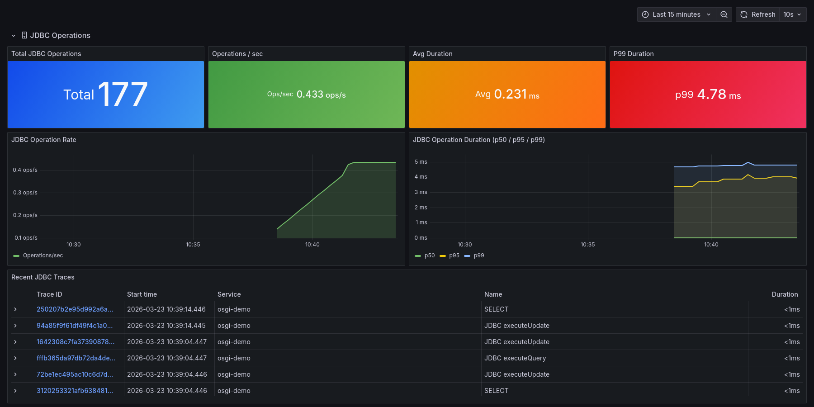
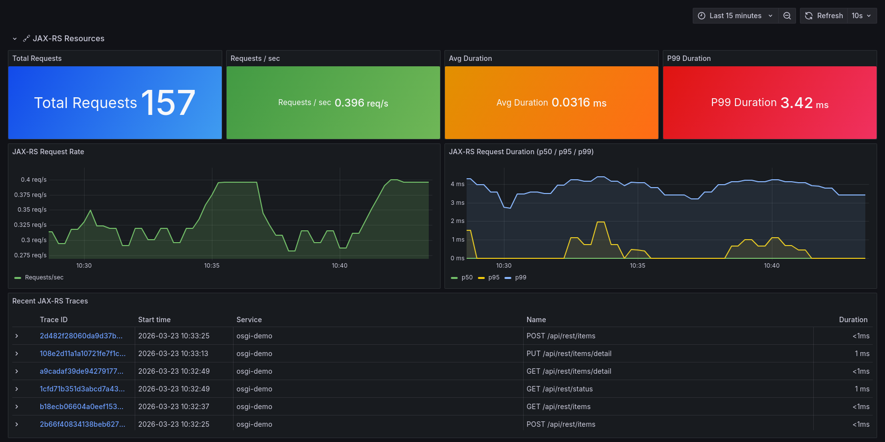

# OpenTelemetry OSGi Weaving

This folder contains the OSGi Weaving Hook based bytecode instrumentation infrastructure for OpenTelemetry.
It provides zero-code instrumentation of application bundles at class-load time using the [OSGi WeavingHook](https://docs.osgi.org/specification/osgi.core/8.0.0/framework.weavinghook.html) mechanism and [ASM](https://asm.ow2.io/) bytecode manipulation.

## Architecture

The weaving system uses a **host bundle + fragment bundle** architecture:

```
opentelemetry-osgi-weaving (host bundle)
├── WeavingHookActivator        — BundleActivator registering the WeavingHook
├── OpenTelemetryWeavingHook    — OSGi WeavingHook delegating to discovered weavers
├── WeaverRegistry              — ServiceLoader-based discovery of Weaver implementations
├── OpenTelemetryProxy          — Graceful proxy for OpenTelemetry service (noop fallback)
├── SafeClassWriter             — ClassWriter using target bundle's classloader for frame computation
├── Weaver                      — SPI interface for weaver implementations
└── ASM 9.7.1 (embedded)       — Private-Package to avoid classloader issues

opentelemetry-osgi-weaver-servlet (fragment bundle)
├── ServletWeaver               — Weaver implementation targeting HttpServlet subclasses
├── ServletClassVisitor         — ASM ClassVisitor identifying servlet handler methods
├── ServletServiceMethodVisitor — ASM AdviceAdapter injecting instrumentation bytecode
├── ServletInstrumentationHelper — Static helper methods called from woven bytecode
└── META-INF/services/...Weaver — Java SPI registration

opentelemetry-osgi-weaver-jdbc (fragment bundle)
├── JdbcWeaver                  — Weaver implementation targeting JDBC Statement implementations
├── JdbcClassVisitor            — ASM ClassVisitor identifying execute* methods
├── JdbcMethodVisitor           — ASM AdviceAdapter injecting instrumentation bytecode
├── JdbcInstrumentationHelper   — Static helper methods called from woven bytecode
└── META-INF/services/...Weaver — Java SPI registration

opentelemetry-osgi-weaver-jaxrs (fragment bundle)
├── JaxRsWeaver                 — Weaver implementation targeting @Path-annotated resources
├── JaxRsClassVisitor           — ASM ClassVisitor reading class/method-level @Path
├── JaxRsMethodVisitor          — ASM AdviceAdapter detecting HTTP method annotations
├── JaxRsInstrumentationHelper  — Static helper methods called from woven bytecode
└── META-INF/services/...Weaver — Java SPI registration
```

Fragment bundles share the host bundle's classloader, so plain Java `ServiceLoader` works without SPI Fly.
The host discovers all weaver implementations at startup and delegates class transformations to matching weavers.

### Class Load Flow

```
OSGi framework loads a class
    │
    ▼
OpenTelemetryWeavingHook.weave(WovenClass)
    │
    ├── Skip infrastructure bundles (Felix, Karaf, Jetty, Pax, Aries, CXF, XBean)
    │
    ├── For each registered Weaver:
    │     ├── weaver.canWeave(className, wovenClass) → yes/no
    │     └── weaver.weave(wovenClass, telemetryProxy) → transform bytecode
    │
    └── Transformed class continues loading
```

### Why BundleActivator (not Declarative Services)?

The WeavingHook must be registered **before** DS component classes are loaded.
If DS were used, the hook would miss weaving DS-managed classes because those classes load during DS component activation.
Using `BundleActivator` ensures the hook is active from the earliest possible point in the bundle lifecycle.

### Safe ClassWriter

The `SafeClassWriter` uses the target bundle's classloader for `COMPUTE_FRAMES` stack map frame computation.
In OSGi, the default `ClassWriter.getCommonSuperClass()` fails because the weaving bundle cannot load classes from the target bundle.
`SafeClassWriter` overrides `getClassLoader()` to use the woven class's `BundleWiring` classloader, falling back to `java/lang/Object` for types that cannot be resolved.

## Modules

### opentelemetry-osgi-weaving

The host bundle providing the weaving infrastructure.

- **WeavingHook** — Registered as an OSGi service; called by the framework for every class load
- **WeaverRegistry** — Discovers `Weaver` implementations via `ServiceLoader.load(Weaver.class)`
- **OpenTelemetryProxy** — Uses `ServiceTracker` to track the `OpenTelemetry` service; returns noop tracers/meters when the service is unavailable
- **SafeClassWriter** — OSGi-safe `ClassWriter` using target bundle classloader for frame computation
- **ASM embedded** — ASM bytecode library is included as `Private-Package` to avoid resolution ordering and classloader visibility issues
- **Infrastructure bundle exclusion** — Skips weaving for Felix, Karaf, Jetty, Pax, Aries, CXF, XBean, and Eclipse Equinox bundles

### opentelemetry-osgi-weaver-servlet

A fragment bundle attaching to the weaving host that instruments `javax.servlet.http.HttpServlet` subclasses.

#### Instrumented Methods

`service`, `doGet`, `doPost`, `doPut`, `doDelete`, `doHead`, `doOptions`, `doTrace` — any method with the signature `(HttpServletRequest, HttpServletResponse)`.

#### Generated Telemetry

**Traces** (span kind: `SERVER`):

| Attribute | Description |
|---|---|
| `http.method` | HTTP method (GET, POST, …) |
| `http.url` | Full request URL |
| `http.query_string` | Query string (if present) |
| `http.servlet.class` | Fully qualified servlet class name |
| `http.status_code` | Response status code |

Span status is set to `ERROR` for status codes ≥ 400.
Exceptions are recorded on the span.

**Metrics**:

| Metric | Type | Description |
|---|---|---|
| `http.server.requests` | Counter | Total HTTP request count (with `http_status_code` label) |
| `http.server.duration` | Histogram | Request duration in milliseconds |

#### Dashboard Preview


### opentelemetry-osgi-weaver-jdbc

A fragment bundle attaching to the weaving host that instruments JDBC `Statement`, `PreparedStatement`, and `CallableStatement` implementations.

#### Instrumented Methods

`execute`, `executeQuery`, `executeUpdate`, `executeBatch`, `executeLargeUpdate`, `executeLargeBatch` — standard JDBC execute methods with and without SQL string parameters.

#### Generated Telemetry

**Traces** (span kind: `CLIENT`):

| Attribute | Description |
|---|---|
| `db.system` | Always `jdbc` |
| `db.operation` | Method name (executeQuery, executeUpdate, …) |
| `db.statement` | SQL statement text (truncated to 1000 chars) |
| `db.jdbc.driver_class` | JDBC driver implementation class name |

Span names are derived from the SQL statement (SELECT, INSERT, UPDATE, DELETE) or fall back to `JDBC <operation>` for prepared statements without visible SQL.

**Metrics**:

| Metric | Type | Description |
|---|---|---|
| `db.client.operations` | Counter | Total JDBC operation count |
| `db.client.duration` | Histogram | Operation duration in milliseconds |

#### Dashboard Preview



### opentelemetry-osgi-weaver-jaxrs

A fragment bundle attaching to the weaving host that instruments JAX-RS resource classes annotated with `@javax.ws.rs.Path`.
The weaver detects HTTP method annotations (`@GET`, `@POST`, `@PUT`, `@DELETE`, `@PATCH`, `@HEAD`, `@OPTIONS`) at the method level and instruments only annotated methods.

#### Detection

The weaver uses ASM `AnnotationVisitor` to detect `@Path` at the class level — **no JAX-RS API dependency is required at compile time for the weaver itself**.
Method-level `@Path` values are combined with the class-level path to form the full route.

#### Generated Telemetry

**Traces** (span kind: `INTERNAL`):

| Attribute | Description |
|---|---|
| `http.method` | HTTP method from annotation (GET, POST, …) |
| `http.route` | Combined class + method @Path value |
| `jaxrs.resource.class` | Fully qualified resource class name |
| `jaxrs.resource.method` | Annotated method name |

Span kind is `INTERNAL` (not `SERVER`) because the outer servlet span already has `SERVER` kind.

**Metrics**:

| Metric | Type | Description |
|---|---|---|
| `jaxrs.server.requests` | Counter | Total JAX-RS request count |
| `jaxrs.server.duration` | Histogram | Request duration in milliseconds |

#### Dashboard Preview



## Adding New Weavers

To add instrumentation for a new target:

1. Create a new module as a fragment bundle attaching to `opentelemetry-osgi-weaving`
2. Implement the `Weaver` interface:
   - `name()` — human-readable name for logging
   - `canWeave(className, wovenClass)` — return `true` for classes to instrument
   - `weave(wovenClass, telemetryProxy)` — transform bytecode using ASM; use `SafeClassWriter` for the `ClassWriter`
3. Register via Java SPI: `META-INF/services/org.eclipse.osgi.technology.incubator.opentelemetry.weaving.Weaver`
4. Set `Fragment-Host: opentelemetry-osgi-weaving` in the bnd configuration
5. Add the bundle to the integration feature descriptor at start-level 20

### Bytecode Transformation Pattern

All weavers follow the same instrumentation pattern using ASM's `AdviceAdapter`:

```java
// Injected by MethodVisitor (AdviceAdapter)
Object[] ctx = InstrumentationHelper.onEnter(args...);
try {
    // original method body
} catch (Throwable t) {
    InstrumentationHelper.onError(ctx, t);
    throw t;
} finally {
    InstrumentationHelper.onExit(ctx);
}
```

Use `SafeClassWriter` (from the weaving host) instead of plain `ClassWriter` to avoid `VerifyError` from incorrect stack map frame computation across OSGi classloader boundaries:

```java
ClassReader reader = new ClassReader(wovenClass.getBytes());
ClassWriter writer = new SafeClassWriter(reader, wovenClass);
```

## Demo

The [demo module](../demo/README.md) includes demonstrations for all three weavers:

- **HttpDemoServlet** — Servlet registered at `/demo/*` with status, slow, and error endpoints
- **HttpTrafficGeneratorComponent** — Periodically hits servlet endpoints every 10 seconds
- **JdbcDemoComponent** — Creates an H2 in-memory database and runs INSERT, SELECT, UPDATE, DELETE queries every 10 seconds
- **JaxRsDemoResource** — JAX-RS annotated resource at `/api/rest/*` with status, items, and detail endpoints
- **JaxRsDispatcherServlet** — Lightweight annotation-based JAX-RS dispatcher (no CXF/Jersey required)
- **JaxRsTrafficGeneratorComponent** — Generates traffic to JAX-RS endpoints every 12 seconds

All demo components are automatically instrumented by the weaving hook — no code changes required.
Access the endpoints at [http://localhost:8181/demo](http://localhost:8181/demo) and [http://localhost:8181/api/rest/status](http://localhost:8181/api/rest/status) when running the Docker demo.
